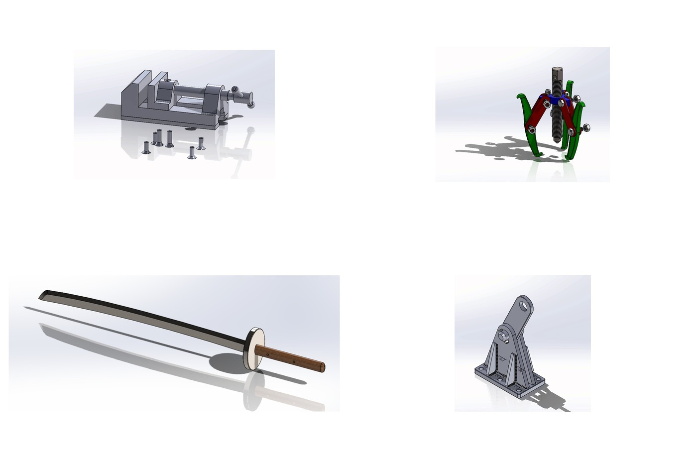
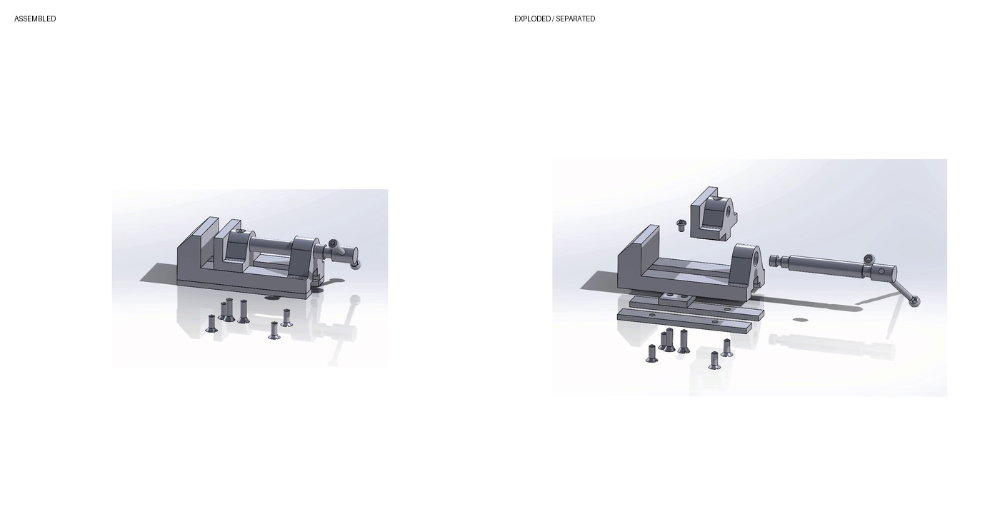
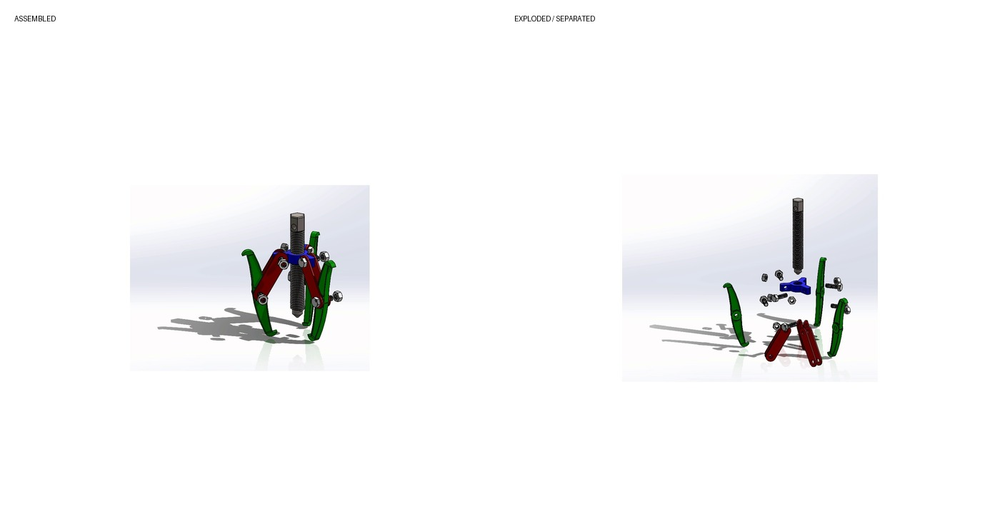
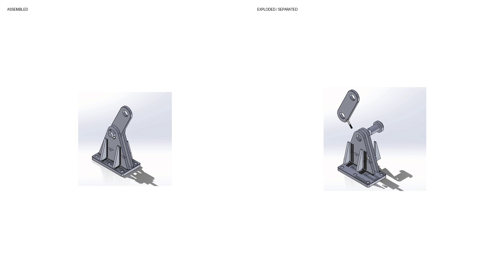
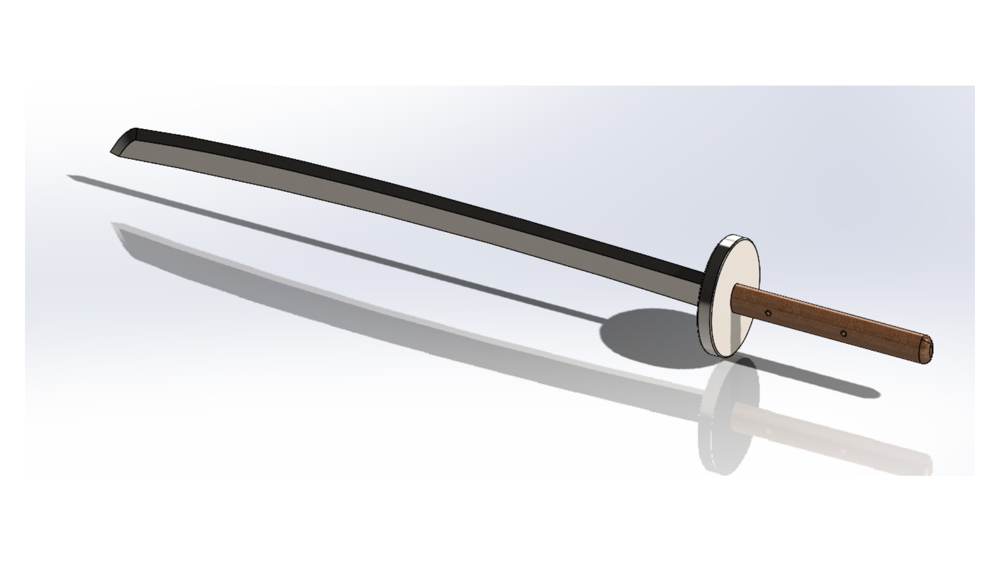
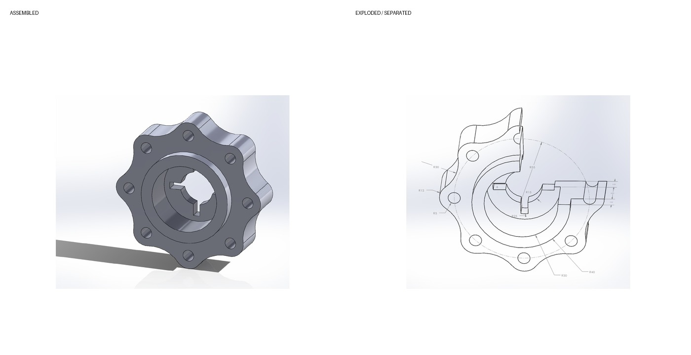
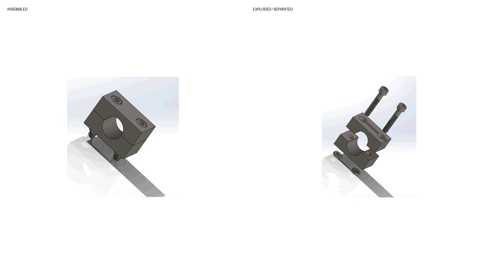
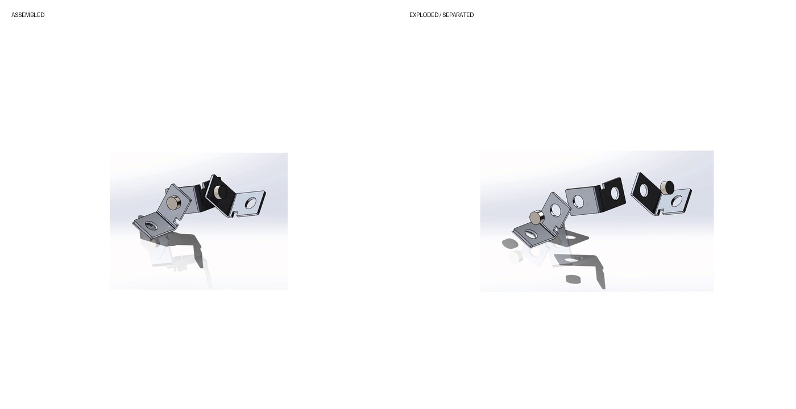
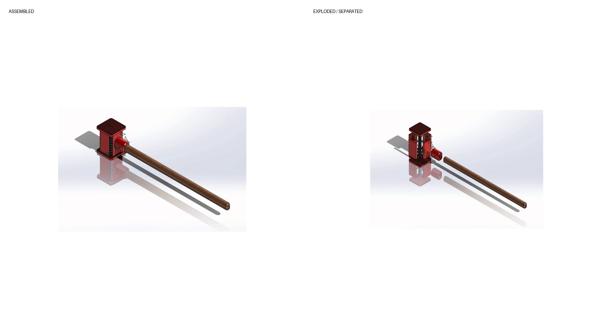

# Michael Alberto - SOLIDWORKS Portfolio

**Computer Engineering Graduate | CAD, Mechanical Assembly & Technical Projects**

This repository is a compact portfolio of selected SOLIDWORKS coursework and personal work. It is designed so a reviewer can understand the projects quickly from images and animations, while the native `.SLDPRT` and `.SLDASM` files remain available for deeper technical review.

> **Context:** Some original assignments were dimension-driven modeling exercises, while others involved assembling supplied or previously created components. The original prompts are no longer available, so the project descriptions below deliberately avoid claiming details that cannot be verified from the saved files.

## Featured projects

### Bench Vise Assembly
*Academic Assembly Project*

A multi-component bench-vise assembly showing how the base, jaw, screw-and-handle components, plates, and fasteners come together in a complete mechanism.

**Demonstrates:** Multi-component assembly · Exploded-view animation · Component organization · Mechanical relationships

[Watch animation](assets/bench-vise.mp4) | [Native CAD files](projects/bench-vise/)

### Three-Jaw Gripper
*Midterm 2*

A three-jaw mechanical gripper assembled from a base support, jaws, connecting plates, a threaded shaft, and fasteners, with an exploded-view animation showing the component relationships.

**Demonstrates:** Mechanical assembly · Repeated components · Exploded-view animation · Part-to-assembly workflow

[Watch animation](assets/three-jaw-gripper.mp4) | [Native CAD files](projects/three-jaw-gripper/)

### Articulated Support Assembly
*Academic Assembly Project*

An articulated support assembly built from base, angle, arm, and hole plates joined by a pin and standard fasteners. The saved animation separates the upper arm and joint hardware from the base assembly.

**Demonstrates:** Plate-based assembly · Joint/pin relationships · Exploded-view animation · Fastener integration

[Watch animation](assets/articulated-support.mp4) | [Native CAD files](projects/articulated-support/)

### Katana Concept
*Personal Project*

A self-directed SOLIDWORKS concept assembled from a blade, guard, handle, and wooden peg. This is included as personal modeling work rather than an academic assignment.

**Demonstrates:** Self-directed modeling · Multi-part assembly · Form development · Part organization

[Native CAD files](projects/katana-concept/)

## Additional CAD work

### Dimension-Driven Part Modeling

A selected part-modeling example preserved with both a finished 3D model view and a measurement reference. It demonstrates translating dimensional information into a modeled SOLIDWORKS part.

**Demonstrates:** Dimension-driven modeling · Part creation · Geometric interpretation · Model verification

[Native CAD files](projects/dimension-driven-part/)

### Saddle Clamp Assembly

A compact clamp-style assembly using upper and lower saddle components with threaded fasteners. The animation separates the cap, screws, and lower hardware to show the assembly stack.

**Demonstrates:** Compact assembly · Fastener placement · Exploded-view animation · Part relationships

[Watch animation](assets/saddle-clamp.mp4) | [Native CAD files](projects/saddle-clamp/)

### Bracket & Pin Linkage

A small bracket-and-pin assembly that combines repeated bent bracket components with cylindrical pins. The exploded sequence shows the separate pieces and their connection points.

**Demonstrates:** Bracket assembly · Repeated components · Pin connections · Exploded-view presentation

[Watch animation](assets/bracket-linkage.mp4) | [Native CAD files](projects/bracket-linkage/)

### Handle / Tool Assembly

A multi-part tool/handle assembly combining a long handle with a compact modeled head and internal components. The animation separates the handle from the head assembly for inspection.

**Demonstrates:** Multi-part assembly · Component fit · Exploded-view animation · Mechanical modeling

[Watch animation](assets/handle-tool.mp4) | [Native CAD files](projects/handle-tool/)

## Skills represented in the archive

- SOLIDWORKS part modeling
- Multi-component assemblies
- Exploded-view animations
- Dimension-driven geometry
- Mechanical component organization
- Mass-property / measurement coursework preserved in the original archive

## Contact

Add your preferred email, LinkedIn, and existing GitHub profile here before publishing.

---
Portfolio source files are shared for hiring and technical-review purposes. No reuse license is granted.